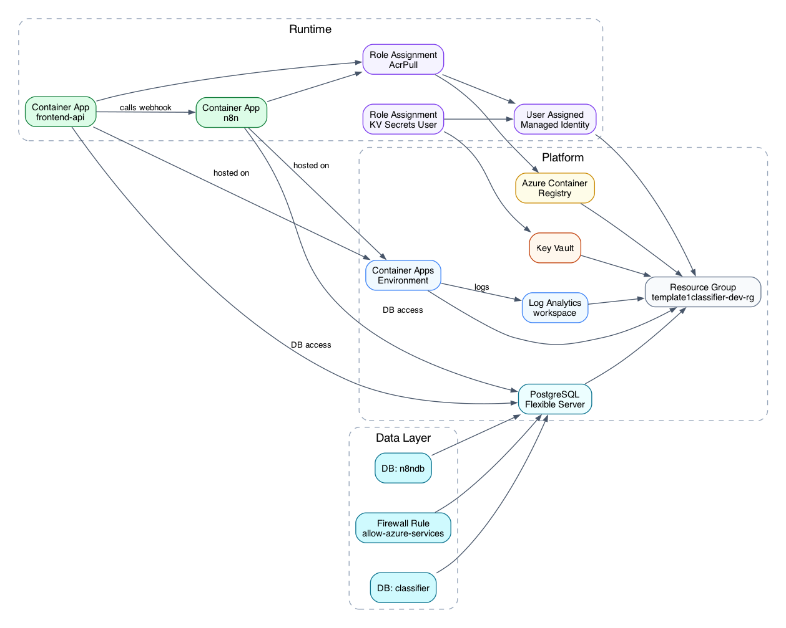

# Template 1 - Azure Classification Workflow

## 1. What This Project Is About
Template 1 is a profile-driven classification workflow for Azure.

It provides:
- A frontend + API service (`app`) to trigger classification runs and view outputs
- n8n orchestration for workflow execution
- PostgreSQL persistence with logical DB separation (`classifier`, `n8ndb`)
- Terraform-based infrastructure provisioning for repeatable deployment

Input model:
- Source URL (website or endpoint)
- Reference URL (website or endpoint)
- Profile-specific parameters

Output model:
- Job records and structured classification results stored in PostgreSQL

Note:
- The reference URL is expected to be a normal reachable URL.
- The arXiv example includes a bundled taxonomy file only because no stable public reference URL was available for that example.

### 1.1 How profiles drive the system
Profiles are the core configuration contract of this template. A profile controls:
- Which input fields are shown in the UI
- Which fields are validated by the API
- Which n8n webhook is called
- How request data is mapped into webhook payload keys

Profile files are loaded at application startup from:
- `Template_1/template/profiles/*.json` (template profiles)
- `Template_1/examples/*/profiles/*.json` (example profiles)

Each profile contains four functional parts:
- `baseFields`: core fields (`sourceUrl`, `referenceUrl`, `runMode`) including labels, defaults, and required flags
- `fields`: dynamic profile-specific inputs (text, number, select, textarea, checkbox)
- `execution.webhookPath` or `execution.webhookUrl`: target workflow endpoint in n8n
- `execution.payloadMap`: dot-path mapping from canonical request input into webhook payload keys

Runtime behavior:
- The app exposes profiles via `GET /api/profiles`
- Only profiles with `status: "active"` can run
- `DEFAULT_PROFILE_ID` selects the default profile if it exists; otherwise first non-example profile is selected
- Profile changes require app restart because profile files are loaded once at startup

---

## 2. How to Use the Template

### 2.1 Prerequisites
- Docker (for image build/push workflows)
- Terraform
- Azure CLI (`az`)

### 2.2 Configure profiles (main template behavior)
1. Start from:
- `Template_1/template/profiles/custom_profile_starter.json`
2. Create a new profile JSON in `Template_1/template/profiles/` (or adapt an existing one).
3. Set:
- `id`: stable profile identifier used by API/UI
- `status`: use `planned` while designing, switch to `active` when runnable
- `baseFields`: source/reference/run mode defaults and validation
- `fields`: dynamic inputs required by your workflow
- `execution.webhookPath` (or `execution.webhookUrl`) and `execution.payloadMap`

Profile status semantics:
- `planned`: visible in UI but run is blocked
- `active`: visible and runnable

Local runtime configuration for profile loading:
- In `docker-compose.yml`, app mounts the full repo as a volume at `/workspace`
- `server.js` reads profiles from `/workspace/template/profiles` and `/workspace/examples/*/profiles`
- After profile edits, reload app:
```bash
docker compose -f Template_1/docker-compose.yml restart app
```

Optional default profile selection:
- Set `DEFAULT_PROFILE_ID` in `Template_1/.env` (and/or `docker-compose.yml`) to auto-select your profile in UI/API requests.

### 2.3 Configure runtime and provider settings
1. Copy environment template:
```bash
cp Template_1/.env.example Template_1/.env
```
2. Set required provider/runtime values in `Template_1/.env`:
- `MODEL_PROVIDER` (`openai` or `azure_openai`)
- `OPENAI_API_KEY`, `OPENAI_MODEL`
- or Azure OpenAI settings (`AZURE_OPENAI_*`)

### 2.4 Configure Terraform variables
Terraform workspace:
- `Template_1/infra/terraform`

Set environment values in:
- `Template_1/infra/terraform/env/dev.tfvars`

Set sensitive Terraform inputs via environment variables before planning/apply:
```bash
export TF_VAR_postgres_admin_password='YOUR_POSTGRES_PASSWORD'
export TF_VAR_n8n_encryption_key='YOUR_N8N_ENCRYPTION_KEY'
export TF_VAR_openai_api_key='YOUR_OPENAI_KEY'
# or Azure OpenAI mode
export TF_VAR_azure_openai_api_key='YOUR_AZURE_OPENAI_KEY'
```

### 2.5 Provision infrastructure
```bash
cd Template_1/infra/terraform
terraform init
terraform validate
terraform plan -var-file="env/dev.tfvars" -out="dev.tfplan"
terraform apply "dev.tfplan"
```

### 2.6 Build and push container images
Build and push `app` and `n8n` images to ACR using tags referenced by `dev.tfvars`.

Then re-apply Terraform if image tags or runtime settings changed.

### 2.7 Apply database migration
Use the migration runner script (cloud mode):
```bash
export CLOUD_DB_HOST='<your-postgres-fqdn>'
export CLOUD_DB_USER='<your-postgres-admin-user>'
export CLOUD_DB_PASSWORD='<your-postgres-admin-password>'
./Template_1/scripts/run_migrations.sh cloud
```

### 2.8 Import and activate workflow in n8n
Import workflow file:
- `Template_1/examples/arxiv_edge_ai/workflows/arxiv_edge_ai_workflow.json`

Activate it in n8n UI.

### 2.9 Test the template with the included example
Use your deployed frontend/API URL (from Terraform outputs) and trigger a run:
```bash
curl -X POST "https://<FRONTEND_API_FQDN>/api/classifications/run" \
  -H "Content-Type: application/json" \
  -d '{
    "profileId": "arxiv_edge_ai",
    "sourceUrl": "https://export.arxiv.org/api/query",
    "referenceUrl": "https://<YOUR_REFERENCE_URL>",
    "runMode": "on_demand",
    "inputs": {
      "arxivCategory": "cs.AI",
      "maxResults": 8
    }
  }'
```

Check results:
```bash
curl "https://<FRONTEND_API_FQDN>/api/classifications?limit=20&offset=0"
curl "https://<FRONTEND_API_FQDN>/api/classifications/<job-id>"
```

Short test guidance:
- If you have your own reference URL, use it directly.
- If you use the bundled arXiv example taxonomy, host that JSON at any reachable URL and pass it as `referenceUrl`.

---

## 3. Important Structure and Interfaces

### 3.1 Key directories
```text
Template_1/
  app/
    migration/
      001_init.sql
    public/
    server.js
  template/
    profiles/
    workflows/
  examples/
    arxiv_edge_ai/
      profiles/
      workflows/
      reference-site/
  postgres-init/
    01_create_n8n_db.sql
  infra/
    terraform/
  scripts/
    run_migrations.sh
  docs/
```

### 3.2 API endpoints
- `POST /api/classifications/run`
- `GET /api/classifications`
- `GET /api/classifications/:id`
- `GET /api/profiles`
- `GET /health`

### 3.3 Profile contract reference
Minimal profile shape:
```json
{
  "id": "your_profile_id",
  "name": "Your Profile Name",
  "description": "What this profile classifies",
  "status": "planned",
  "isExample": false,
  "baseFields": {
    "sourceUrl": { "required": true, "default": "" },
    "referenceUrl": { "required": false, "default": "" },
    "runMode": { "default": "on_demand", "options": ["on_demand", "scheduled"] }
  },
  "fields": [],
  "execution": {
    "webhookPath": "classifications/run-your-profile",
    "payloadMap": {
      "profileId": "profileId",
      "sourceUrl": "sourceUrl",
      "referenceUrl": "referenceUrl",
      "runMode": "runMode",
      "inputs": "inputs"
    }
  }
}
```

Execution mapping notes:
- If `payloadMap` is empty, canonical request is forwarded as-is
- If `payloadMap` is set, only mapped keys are sent to n8n
- Dot paths like `inputs.maxItems` are supported

### 3.4 Database model essentials
- `classifier` database: application tables and classification records
- `n8ndb` database: n8n internal runtime metadata

Migration files:
- `001_init.sql`: base tables plus profile/input payload columns (`profile_id`, `input_payload_json`)

### 3.5 Cloud resources provisioned by Terraform
- Resource Group
- Log Analytics Workspace
- Azure Container Registry
- Azure Container Apps Environment
- Azure Container Apps (`frontend-api`, `n8n`)
- Azure Key Vault
- Azure Database for PostgreSQL Flexible Server
- Managed Identity and RBAC role assignments

---

## 4. Cloud Infrastructure Diagram


