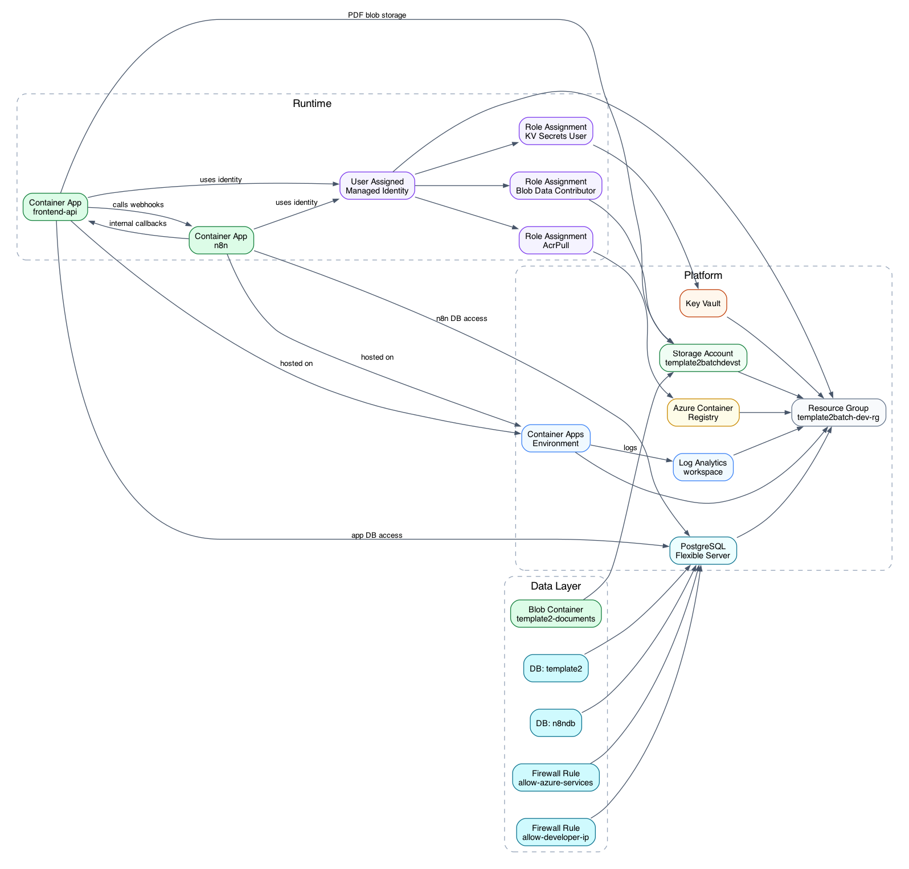

# Template 2 - Azure Sync and Batch Document Workflow

## 1. What This Project Is About
Template 2 is a profile-driven document workflow template for Azure.

It provides:
- A frontend + API service (`app`) for user auth, document upload, workflow runs, and result viewing
- n8n orchestration for sync and batch workflow execution
- PostgreSQL persistence with logical DB separation (`template2`, `n8ndb`)
- Azure Blob Storage wiring for cloud document storage
- Terraform-based infrastructure provisioning for repeatable deployment

Input model:
- Profile selection
- Profile-specific parameters
- Execution mode (`sync` or `batch`)
- Batch strategy selection

Output model:
- Job records and workflow results stored in PostgreSQL
- Provider metadata such as model, token usage, latency, and estimated cost
- Batch window and batch item records for async execution

Included example:
- `pdf_batch_summary`: PDF summarization with sync execution through OpenAI Responses and async execution through OpenAI Batch.

Note:
- The template is intended to be reused by adding new profiles and n8n workflows.
- The default API/table names use `summaries` because the included example is PDF summarization.

### 1.1 How profiles drive the system
Profiles are the core configuration contract of this template. A profile controls:
- Which execution fields are shown in the UI
- Which fields are validated by the API
- Which n8n webhook is called
- How request data is mapped into webhook payload keys

Profile files are loaded at application startup from:
- `Template_2/template/profiles/*.json` (template profiles)
- `Template_2/examples/*/profiles/*.json` (example profiles)

Each profile contains three functional parts:
- `fields`: dynamic profile-specific inputs (`executionMode`, `batchStrategy`, and any additional fields)
- `execution.webhookPath` or `execution.webhookUrl`: target workflow endpoint in n8n
- `execution.payloadMap`: dot-path mapping from canonical request input into webhook payload keys

Runtime behavior:
- The app exposes profiles via `GET /api/profiles`
- Only profiles with `status: "active"` can run
- `DEFAULT_PROFILE_ID` selects the default profile if it exists; otherwise first non-example profile is selected
- Profile changes require app restart because profile files are loaded once at startup

### 1.2 Sync and batch execution
Template 2 supports two execution modes behind the same profile contract.

Sync mode:
- Creates one job for one uploaded document
- Dispatches the job to n8n immediately
- n8n executes the provider call and writes the result back through the app/internal APIs

Batch mode:
- Creates queued jobs
- n8n selects queued candidates
- The backend atomically claims a batch window through `/api/internal/batches/open`
- n8n creates a provider batch, polls it, and persists result rows by job ID

Current supported batch strategy:
- `count_only`

Batch controls:
- `MAX_BATCH_SIZE`
- `MAX_WAIT_SECONDS`

---

## 2. How to Use the Template

### 2.1 Prerequisites
- Docker
- Terraform
- Azure CLI (`az`)
- OpenAI API key for the included PDF summarization example

### 2.2 Configure profiles (main template behavior)
1. Start from:
- `Template_2/template/profiles/custom_profile_starter.json`
2. Create a new profile JSON in `Template_2/template/profiles/` or adapt an existing example profile.
3. Set:
- `id`: stable profile identifier used by API/UI
- `status`: use `planned` while designing, switch to `active` when runnable
- `fields`: dynamic inputs required by your workflow
- `execution.webhookPath` or `execution.webhookUrl`
- `execution.payloadMap`

Profile status semantics:
- `planned`: visible in UI but run is blocked
- `active`: visible and runnable

Local runtime configuration for profile loading:
- In `docker-compose.yml`, the app mounts the full repo as a volume at `/workspace`
- `server.js` reads profiles from `/workspace/template/profiles` and `/workspace/examples/*/profiles`
- After profile edits, reload app:
```bash
docker compose --env-file Template_2/.env -f Template_2/docker-compose.yml restart app
```

Optional default profile selection:
- Set `DEFAULT_PROFILE_ID` in `Template_2/.env` and/or Terraform runtime settings to auto-select your profile in UI/API requests.

### 2.3 Configure runtime and provider settings
1. Copy environment template:
```bash
cp Template_2/.env.example Template_2/.env
```

2. Set required local runtime values in `Template_2/.env`:
- `OPENAI_API_KEY`
- `OPENAI_MODEL`
- `SESSION_SECRET`
- `INTERNAL_API_TOKEN`
- `ADMIN_EMAIL`
- `ADMIN_PASSWORD`

3. Set execution and pricing values as needed:
- `MAX_BATCH_SIZE`
- `MAX_WAIT_SECONDS`
<!-- Based on the model being used as there are analytical calculations done based on the tokens consumed. The total cost is not coming from the AI model provider -->
- `OPENAI_INPUT_TOKEN_PRICE_PER_MILLION_USD`
- `OPENAI_OUTPUT_TOKEN_PRICE_PER_MILLION_USD`
- `OPENAI_BATCH_INPUT_TOKEN_PRICE_PER_MILLION_USD`
- `OPENAI_BATCH_OUTPUT_TOKEN_PRICE_PER_MILLION_USD`

### 2.4 Configure Terraform variables
Terraform workspace:
- `Template_2/infra/terraform`

Set environment values in:
- `Template_2/infra/terraform/env/dev.tfvars`

Set sensitive Terraform inputs via environment variables before planning/apply:
```bash
export TF_VAR_postgres_admin_password='YOUR_POSTGRES_PASSWORD'
export TF_VAR_n8n_encryption_key='YOUR_N8N_ENCRYPTION_KEY'
export TF_VAR_session_secret='YOUR_SESSION_SECRET'
export TF_VAR_internal_api_token='YOUR_INTERNAL_API_TOKEN'
export TF_VAR_admin_password='YOUR_ADMIN_PASSWORD'
export TF_VAR_openai_api_key='YOUR_OPENAI_KEY'
```

### 2.5 Provision infrastructure
```bash
cd Template_2/infra/terraform
terraform init
terraform validate
terraform plan -var-file="env/dev.tfvars" -out="dev.tfplan"
terraform apply "dev.tfplan"
```

### 2.6 Build and push container images
Build and push the `app` image to ACR using the tag referenced by `dev.tfvars`:
```bash
docker buildx build --platform linux/amd64 \
  -t "<ACR_LOGIN_SERVER>/template2-app:<TAG>" \
  -f Template_2/app/Dockerfile Template_2 \
  --push
```

n8n uses the image configured in `dev.tfvars`. The current deployment uses the public `n8nio/n8n:latest` image.

Re-apply Terraform if image tags or runtime settings changed.

### 2.7 Apply database migration
Local mode:
```bash
./Template_2/scripts/run_migrations.sh local
```

Cloud mode:
```bash
export CLOUD_DB_HOST='<your-postgres-fqdn>'
export CLOUD_DB_USER='<your-postgres-admin-user>'
export CLOUD_DB_PASSWORD='<your-postgres-admin-password>'
export CLOUD_DB_NAME='template2'
export CLOUD_DB_SSLMODE='require'
./Template_2/scripts/run_migrations.sh cloud
```

### 2.8 Import and activate workflow in n8n
For the included PDF summarization example, import:
- `Template_2/examples/pdf_batch_summary/workflows/wf_template2_unified.json`

Activate it in n8n UI.

Workflow webhooks:
- Runtime: `POST /webhook/summaries/run`
- Benchmark: `POST /webhook/benchmarks/run`

### 2.9 Test the template with the included example
Use the UI:
1. Open the deployed frontend/API URL from Terraform outputs.
2. Login using the configured admin account or register a user.
3. Upload a PDF.
4. Select the `PDF Batch Summarization` profile.
5. Choose `sync` or `batch`.
6. Submit the run.
7. Check job status and result in the UI.

Use API health check:
```bash
curl "https://<FRONTEND_API_FQDN>/health"
```

<!-- Batch test guidance:
- If `MAX_BATCH_SIZE=2`, submit two batch jobs for a batch window to be created.
- If fewer than `MAX_BATCH_SIZE` jobs are queued, the batch path exits cleanly and waits for more jobs. -->

---

## 3. Important Structure and Interfaces

### 3.1 Key directories
```text
Template_2/
  app/
    migration/
      001_init.sql
    public/
    server.js
  template/
    profiles/
    workflows/
  examples/
    pdf_batch_summary/
      profiles/
      workflows/
  postgres-init/
    01_create_n8n_db.sql
  infra/
    terraform/
  scripts/
    run_migrations.sh
    test_uniform_ui.sh
    run_sync_benchmark.sh
    run_batch_benchmark.sh
  docs/
```

### 3.2 API endpoints
- `GET /api/profiles`
- `POST /api/auth/register`
- `POST /api/auth/login`
- `POST /api/auth/logout`
- `GET /api/auth/me`
- `POST /api/documents/upload`
- `GET /api/documents`
- `GET /api/documents/:id`
- `POST /api/summaries/run`
- `GET /api/summaries/jobs`
- `GET /api/summaries/jobs/:id`
- `GET /api/summaries/jobs/:id/result`
- `GET /api/admin/jobs`
- `GET /api/admin/batches`
- `GET /api/admin/metrics`
- `GET /health`

Internal endpoints used by n8n:
- `GET /api/internal/jobs/:id/context`
- `POST /api/internal/jobs/:id/openai-file`
- `POST /api/internal/openai/files/upload-text`
- `POST /api/internal/jobs/:id/status`
- `POST /api/internal/batches/open`
- `GET /api/internal/batches/pending`
- `POST /api/internal/batches/:id/status`
- `POST /api/internal/batches/:id/ingest`

### 3.3 Profile contract reference
Minimal profile shape:
```json
{
  "id": "your_profile_id",
  "name": "Your Profile Name",
  "description": "What this profile processes",
  "status": "planned",
  "isExample": false,
  "fields": [
    {
      "key": "executionMode",
      "label": "Execution Mode",
      "type": "select",
      "required": true,
      "default": "sync",
      "options": [
        { "label": "Sync", "value": "sync" },
        { "label": "Batch", "value": "batch" }
      ]
    },
    {
      "key": "batchStrategy",
      "label": "Batch Strategy",
      "type": "select",
      "required": true,
      "default": "count_only",
      "options": [
        { "label": "Count Only", "value": "count_only" }
      ]
    }
  ],
  "execution": {
    "webhookPath": "summaries/run",
    "payloadMap": {
      "profileId": "profileId",
      "jobId": "jobId",
      "userId": "userId",
      "documentId": "documentId",
      "executionMode": "executionMode",
      "batchStrategy": "batchStrategy"
    }
  }
}
```

Execution mapping notes:
- If `payloadMap` is empty, canonical request is forwarded as-is
- If `payloadMap` is set, only mapped keys are sent to n8n
- Dot paths like `inputs.maxItems` are supported

### 3.4 Database model essentials
- `template2` database: application users, documents, jobs, results, batch windows, batch items, and benchmark records
- `n8ndb` database: n8n internal runtime metadata

Main application tables:
- `users`
- `documents`
- `summary_jobs`
- `summary_results`
- `batch_windows`
- `batch_items`
- `benchmark_runs`
- `benchmark_samples`

Auth model:
- App users are local application users.
- Passwords are stored as bcrypt hashes in `users.password_hash`.
- Microsoft Entra ID login is not implemented in the current template.

### 3.5 Cloud resources provisioned by Terraform
- Resource Group
- Log Analytics Workspace
- Azure Container Registry
- Azure Container Apps Environment
- Azure Container Apps (`frontend-api`, `n8n`)
- Azure Key Vault
- Azure Database for PostgreSQL Flexible Server
- Storage Account + Blob Container
- Managed Identity and RBAC role assignments
- PostgreSQL firewall rules (`allow-azure-services`, optional `allow-developer-ip`)

---

## 4. Cloud Infrastructure Diagram


